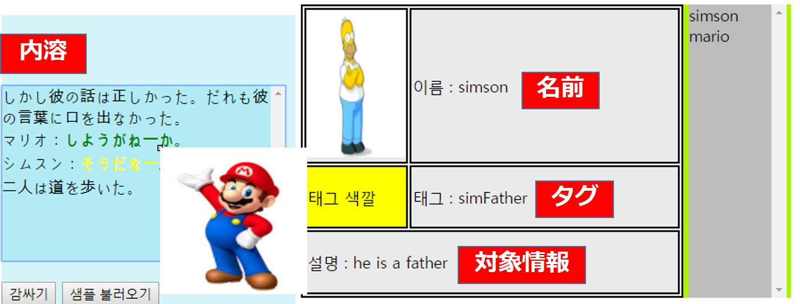

# プロジェクト名｜ 作家の部屋モジュールテスト

* 開発期間 / 開発人員｜ 2017. 3. 13 ~ 2017. 3. 29(２週間)

* 概要｜ 作家の部屋プロジェクトを開発する前の技術的テスト

## 1. Tag Editor
* 紹介｜エディター機能に人物のタグを適用するためのテスト
* 開発環境｜ Php, JavaScript, jQuery, MySql

## 2. Map Maker
* 紹介｜地図を描くためのテスト
* 開発環境｜ Php, JavaScript, jQuery

## 3. Auto Complete
* 紹介｜小説を書きながら人物のタグを自動検査し、適用するためのテスト
* 開発環境｜ Php, JavaScript, jQuery, MySql

## 4. Chapter
* 紹介｜小説を書きながら小説の単位をドラックで簡単に位置を変えるためのテスト
* 開発環境｜ Php, JavaScript, jQuery

## 5. Mind Map
* 紹介｜マインドマップの形の人物相関図を実装するためのテスト
* 開発環境｜ Php, JavaScript, jQuery, D3.js

